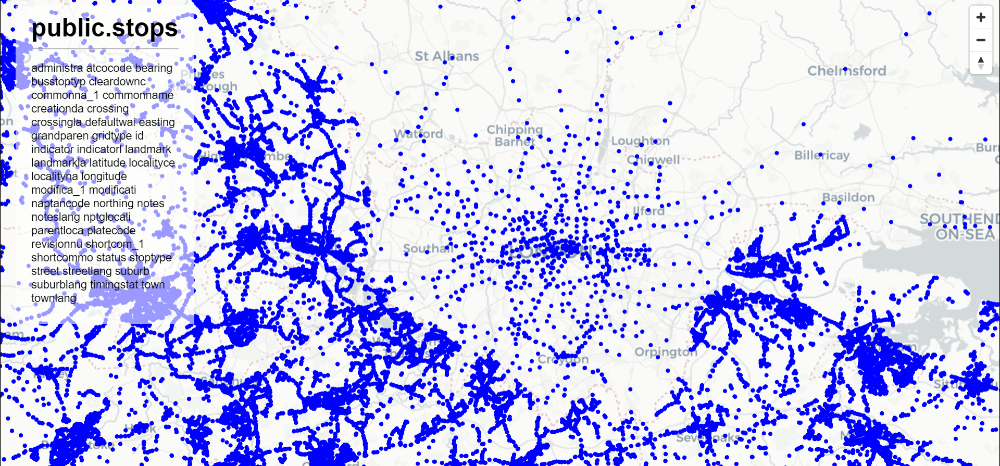

# GeoREST-API

A Dockerized REST API for geospatial services based on OGCAPI Features and OGCAPI Tiles. A work-in-progress.

## Motivation
- *WMS is dead(ish). Long Live OGCs.*
  
  XML is one of legacy of the early internet age, and even more so in geospatial realm where GML is still the golden standard for information exchange and shapefiles rules the desktop. [OGCAPI](https://ogcapi.ogc.org/) is a set of standard based on [what's good in today's internet era](https://www.w3.org/TR/sdw-bp/). The Standards are intended to [gradually replace](https://ogcapi.ogc.org/apiroadmap.html) the old standards for geospatial data information exchange on the internet (i.e., WMS, WFS, CSW, etc).

- *Fast is better than slow*

  A lot of geospatial web server does the job very well, but it grows in complexity when bigger data or faster processing is needed. Not to mention the problems when dealing with monolythic architecture for production-ready services (e.g. microservices deployment). It is easier to have some components quickly ready for prototyping, and scale accordingly. Scroll down to 'How to Use' and see for yourself. 
  P.S. Geoserver have plan for completely supporting OGC-APIs [in near future](https://docs.geoserver.geo-solutions.it/edu/en/ogcapi/install.html), but still..

- *Simple is better than complicated.*
  
  Each component in this stack can be easily deployed as a microservices instead of a single monorepo. But again, this repo works well for quick backend serving APIs in prototyping a WebGIS frontend, since only minimal configurations are needed. A short `docker compose` command is all you need to get the services running. 

## How to use
1. Clone this repo
2. Install Docker and Docker Compose
3. Create a '.env' file and fill in corresponding environment variables
4. `docker compose up -d`

And that's it. Fire up your browser and consume this endpoints:
- `localhost/tiles` for OGC Tiles interface
- `localhost/features` for OGC Features interface
- `localhost/api` for PostgREST OpenAPI interface

Useful for quick prototyping and development stage. For production ready deployment, see [Hardening Postgrest](https://postgrest.org/en/stable/admin.html). Other docker compose files are also available for example of different deployment scenario.

A frontend WebGIS consuming this architecture (based on MaplibreJS) is a WIP in [Next-WebGIS Repository](https://github.com/danylaksono/next-webgis). 

## Stacks
- [Traefik](https://traefik.io/) for proxying. Also for caching tiles from pg_tileserv.
- [pg_tileserv](https://github.com/CrunchyData/pg_tileserv). Vector Tile Service based on [OGC Tiles](https://ogcapi.ogc.org/tiles/), a.k.a. 'WMS'
- [pg_featureserv](https://ogcapi.ogc.org/features/). A very thin, PostGIS only implementation of [OGC Features](https://ogcapi.ogc.org/features/), a.k.a. 'WFS'
- [PostgREST](https://postgrest.org/en/stable/). RESTFull API for PostgreSQL Database.

Dedicated PostGIS is optional and therefore is not needed. I recommend [Kartoza's PostGIS](https://github.com/kartoza/docker-postgis) for production-ready PostGIS instance.

## License

This work is licensed under [MIT LICENSE](https://opensource.org/licenses/MIT).

